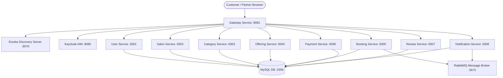

# StyleHub - Multi-Tenant Salon Booking & Management Platform

StyleHub is a premium, enterprise-grade multi-tenant salon discovery, booking, and management application. It features a modern microservices backend built on Spring Cloud and a responsive, high-fidelity Single Page Application (SPA) frontend built on React, Vite, Tailwind CSS, and Material-UI.

---

## 🏗️ Architecture Blueprint

StyleHub is decomposed into 10 Java microservices orchestrating business flows and 3 core infrastructure components:



### Downstream Business Services
* **User Service** (`:5001`): Customer & Salon Owner account profiles.
* **Salon Service** (`:5002`): Salon tenant registry and metadata.
* **Category Service** (`:5003`): Category taxonomy for styling and wellness treatments.
* **Service Offering Service** (`:5004`): Treatment catalog, pricing, and durations.
* **Booking Service** (`:5005`): Slot allocation, reservations, and state machines.
* **Payment Service** (`:5006`): Gateway integrations and payouts.
* **Review Service** (`:5007`): Customer ratings and review processing.
* **Notification Service** (`:5008`): WebSocket-based real-time alerts.

---

## 🎨 Interactive Showcase Features

1. **Dual-Persona Auth Gateway**: Switch between **Customer** and **Partner** portals with an integrated **Demo Autofill ⚡** login utility.
2. **Proximity Location Filter**: A Swiggy/Zomato-style tabbed location filter listing active cities (London, Manchester, Hyderabad) and live-filtering cards.
3. **Amenities Grid**: Beautiful preview of service-specific facilities (WiFi, A/C, welcome drinks, certified stylists) on the details view.
4. **Dynamic Ratings**: Star rating badges generated dynamically per salon card.

---

## 🚀 Quick Start Guide

### 1. Prerequisites
* **Docker Desktop** installed and running
* **Node.js** (v18+)
* **Java 17+** & **Maven** (only if compiling backend from source)

### 2. Start the Backend Microservices
Open a PowerShell terminal in `StyleHub_Backend-main` and spin up containers sequentially:
```powershell
# 1. Start core infrastructure
docker compose up -d stylehub-mysql rabbitmq

# 2. Start Keycloak IAM
cd keycloak; docker compose up -d; cd ..

# 3. Start Eureka Discovery Server
docker compose up -d eureka-server

# 4. Start Gateways & Core API routing
docker compose up -d user-service gateway-service

# 5. Start Catalog Services
docker compose up -d salon-service category-service service-offering-service

# 6. Start Booking & Transaction Services
docker compose up -d booking-service payment-service review-service notification-service
```

### 3. Populate Demo Dataset (London, Manchester, Hyderabad)
While the containers are running, execute the populate script to set up mock salons, categories, offerings, and bookings:
```powershell
powershell -ExecutionPolicy Bypass -File .\populate-demo-data.ps1
```

### 4. Start the Frontend Server
Open a separate terminal in `StyleHub_Frontend-main` and run:
```bash
npm install
npm run dev
```
Open **[http://localhost:3000](http://localhost:3000)** in your browser!

---

## 🎭 Demo Credentials
Use these static accounts to log in instantly via the autofill buttons:

* **Salon Owner (London)**: `jane.stylist_demo@example.com` (Password: `DemoOwnerPass1!`)
* **Salon Owner (Manchester)**: `sergei.spa_demo@example.com` (Password: `DemoOwnerPass1!`)
* **Customer**: `alice.smith_demo@example.com` (Password: `DemoCustPass1!`)
