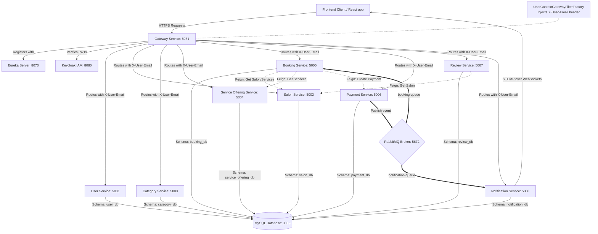

# StyleHub Backend Microservices 

StyleHub is a high-performance, multi-tenant Salon Booking & Management platform. This repository contains the backend microservices architecture built using **Spring Boot 3.x**, **Spring Cloud**, **Keycloak IAM**, **RabbitMQ**, and **MySQL**.

---

## 🗺️ System Topology & Data Flow



---

## 🛠️ Microservices Catalog

| Service Name | Port | Database | Context Consumption (`X-User-Email`) | Key Role |
| :--- | :---: | :---: | :---: | :--- |
| **Eureka Server** | `8070` | N/A | No | Service Discovery Registry |
| **Gateway Service** | `8081` | N/A | **Enforcer / Injector** | Policy Enforcement Point & Context Injection |
| **User Service** | `5001` | `user_db` | Yes | Local user profile store & Keycloak proxy |
| **Salon Service** | `5002` | `salon_db` | Yes | Storefront catalog & owner registrations |
| **Category Service**| `5003` | `category_db` | Yes | Service classifications |
| **Service Offering**| `5004` | `service_offering_db`| Yes | Specific treatments with duration & price |
| **Booking Service** | `5005` | `booking_db` | Yes | Appointment slot booking & earnings reports |
| **Payment Service** | `5006` | `payment_db` | Yes | Payment processor integrations (Razorpay/Stripe) |
| **Review Service**  | `5007` | `review_db` | Yes | Rating and feedback engine |
| **Notification Service**| `5008`| `notification_db`| Yes | RabbitMQ consumer & STOMP WebSocket broker |

---

## ⚙️ Running the Optimized System

### 1. Build and Run via Docker Compose
All microservices are fully containerized and set up with automatic dependency wave sequencing:
```bash
# Build all services in parallel
docker compose build --parallel

# Start the cluster with wave-based scheduling
bash start-services.sh
```

### 2. E2E Integration Suite Validation
We have included a full E2E automated test suite that verifies Keycloak signup/login, salon registration, category/offering publication, and Razorpay/Stripe checkout flows under the new context-propagated architecture:
```bash
bash test-integration-suite.sh
```
*(Verify that the console output returns `E2E MICROSERVICES INTEGRATION COMPLETED 100% SUCCESSFULLY!`)*
