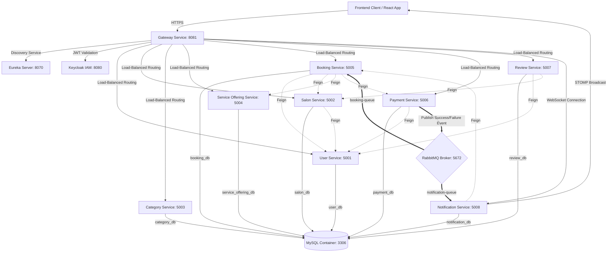

# StyleHub Backend Microservices

StyleHub is a high-performance, multi-tenant Salon Booking & Management platform. This repository contains the backend microservices architecture built using **Spring Boot 3.x**, **Spring Cloud**, **Keycloak IAM**, **RabbitMQ**, and **MySQL**.

---

## 🗺️ System Architecture & Message Flow

The diagram below represents the service topology, inter-service communication (REST via OpenFeign), database isolation boundaries, and the event-driven transactional message flow (Saga Choreography) for payment checkouts:



---

## ⚡ Core Features

- **Edge Authentication & Context Propagation**: Centralized OAuth2/OIDC JWT validation at the Spring Cloud API Gateway, propagating user identity downwards through lightweight `X-User-Email` HTTP headers.
- **Event-Driven Eventual Consistency (Saga)**: Booking status confirms or cancels asynchronously when the payment service emits a success or failure event onto the RabbitMQ broker (`booking-queue`).
- **Dynamic Service Discovery**: Central registration and heartbeats using a Netflix Eureka server with client-side load balancing.
- **Synchronous Declarative Clients**: OpenFeign integrations simplify service-to-service communication.
- **Conflict Prevention Engine**: Core scheduling algorithm verifying salon operating hours and slot overlaps (ignoring CANCELLED bookings) to prevent double bookings.
- **Real-Time Notification Dispatch**: Immediate alerts delivered to users and salon owners over STOMP WebSockets (using SockJS).
- **Logical Schema Separation**: Service-specific databases hosted as isolated logical schemas inside a shared MySQL cluster.

---

## 🗂️ Microservices Grid

| Service | Port | Database | Purpose | Key Dependencies |
| :--- | :--- | :--- | :--- | :--- |
| **Eureka Server** | `8070` | N/A | Service Discovery | None |
| **Gateway Service** | `8081` | N/A | Routing, CORS, Edge Security | Eureka, Keycloak |
| **User Service** | `5001` | `user_db` | Authentication Proxy, User Profiles | Keycloak Admin API |
| **Salon Service** | `5002` | `salon_db` | Salon listings, locations, operating hours | User Service |
| **Category Service** | `5003` | `category_db` | Salon categorization system | Salon Service |
| **Service Offering** | `5004` | `service_offering_db` | Service details, prices, and durations | Salon, Category |
| **Booking Service** | `5005` | `booking_db` | Bookings lifecycle, slot checks, reports | RabbitMQ, User, Salon |
| **Payment Service** | `5006` | `payment_db` | Payment links (Razorpay, Stripe) | RabbitMQ, User |
| **Review Service** | `5007` | `review_db` | User ratings and reviews | User, Salon |
| **Notification Service** | `5008` | `notification_db` | Real-time WebSocket alerts | RabbitMQ, Booking |

---

## ⚙️ Configuration & Environment Variables

Define the following environment variables before booting up the platform (e.g., in `.env` or system profiles):

```properties
# Keycloak IAM Configuration
KEYCLOAK_URL=http://stylehub-keycloak:8080
KEYCLOAK_CLIENT_ID=stylehub-client
KEYCLOAK_CLIENT_SECRET=your_keycloak_client_secret
KEYCLOAK_ADMIN_USERNAME=admin
KEYCLOAK_ADMIN_PASSWORD=admin

# Payment Gateway Configuration
STRIPE_API_KEY=sk_test_...
RAZORPAY_API_KEY=rzp_test_...
RAZORPAY_API_SECRET=your_razorpay_secret
```

---

## 🛠️ Build and Deployment Guide

### Prerequisites
- Java 17 JDK or higher
- Maven 3.8+
- Docker and Docker Compose

### 1. Compile Codebase
Build all microservices inside the project root:
```bash
mvn clean package -DskipTests
```

### 2. Startup Sequential Wave Orchestration
To prevent memory crashes on standard dev hosts, start the cluster sequentially in waves using the provided startup script:
```bash
chmod +x start-services.sh
./start-services.sh
```

#### Startup Waves Details:
- **Wave 0**: MySQL DB and RabbitMQ.
- **Wave 0.5**: Keycloak Server (imports realm configuration from `keycloak/realm-export.json`).
- **Wave 1**: Eureka Discovery Server.
- **Wave 2**: Gateway and User Services.
- **Wave 3**: Salon, Category, and Offering Services.
- **Wave 4**: Booking, Payment, and Notification Services.

---

## 🧪 Integration Verification

Verify end-to-end service registration, token handshakes, and appointment flow triggers by running the integration test suite:
```bash
chmod +x test-integration-suite.sh
./test-integration-suite.sh
```
